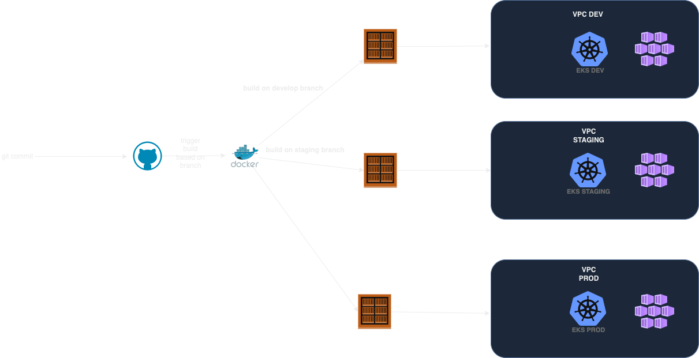

# Example Voting App

A simple distributed application running across multiple Docker containers.

## Getting started

This project used to develop application in Kubernetes. Terraform used to create infrastructure in EKS, Helm charts used to create deployment files for microservice based appplication, Githubaction used to create docker image and push it to ECR. 



## Prepare EKS cluster 

0. Create AWS Account
1. Create S3 bucket and DynamoDB for saving terraform states  
2. Change variables in terraform scripts:
    - network, region, version of kubernetes  in `terraform/terraform-aws-eks/environments/eks-dev/main.tf`
    - name of cluster `terraform/terraform-aws-eks/environments/eks-dev/variables.tf`
    - terraform states files for saving states `terraform/terraform-aws-eks/environments/eks-dev/versions.tf`
    - Node Autoscaling files in `terraform/terraform-aws-eks/environments/eks-dev/main.tf`

3. Run script for specific environment from directory `terraform/terraform-aws-eks/environments/eks-dev`

   ```python
    terraform init
    terraform fmt
    terraform validate
    terraform plan
    terraform apply
   
   ```

4. Install ingress controller any which you want

   -  
   - 
   - 


## Architecture


* A front-end web app in [Python](/vote) which lets you vote between two options
* A [Redis](https://hub.docker.com/_/redis/) which collects new votes
* A [.NET](/worker/) worker which consumes votes and stores them in…
* A [Postgres](https://hub.docker.com/_/postgres/) database backed by a Docker volume
* A [Node.js](/result) web app which shows the results of the voting in real time

## Notes

The voting application only accepts one vote per client browser. It does not register additional votes if a vote has already been submitted from a client.

This isn't an example of a properly architected perfectly designed distributed app... it's just a simple
example of the various types of pieces and languages you might see (queues, persistent data, etc), and how to
deal with them in Docker at a basic level.
